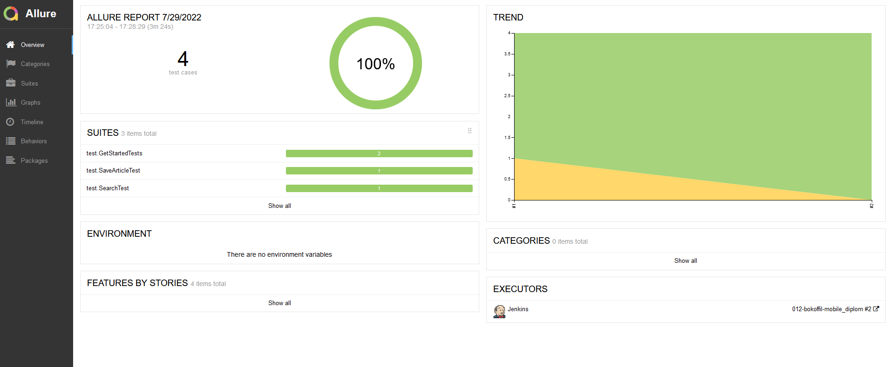
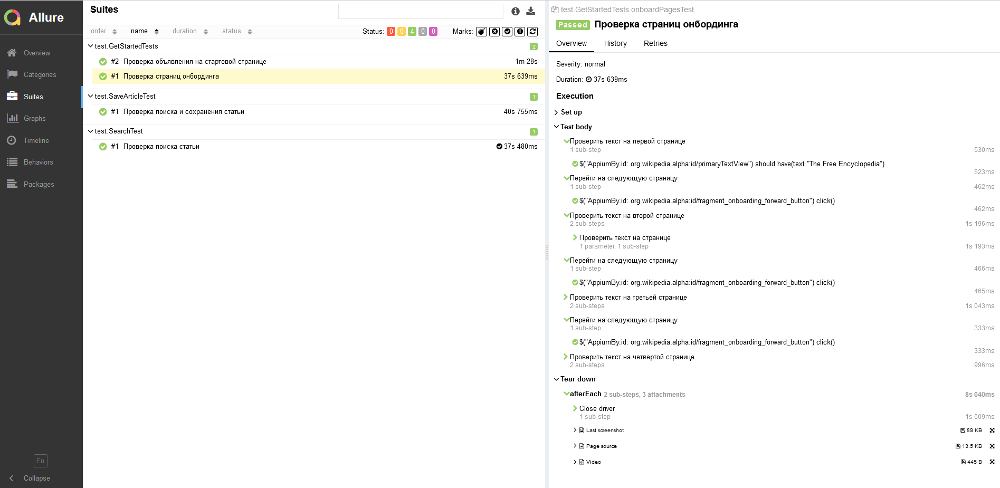
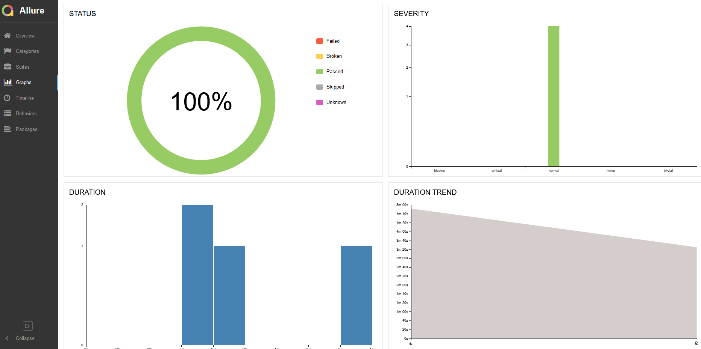
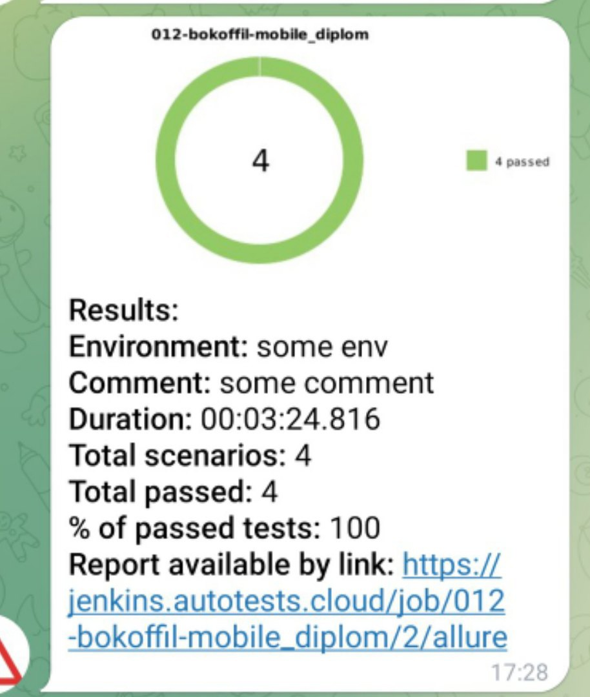
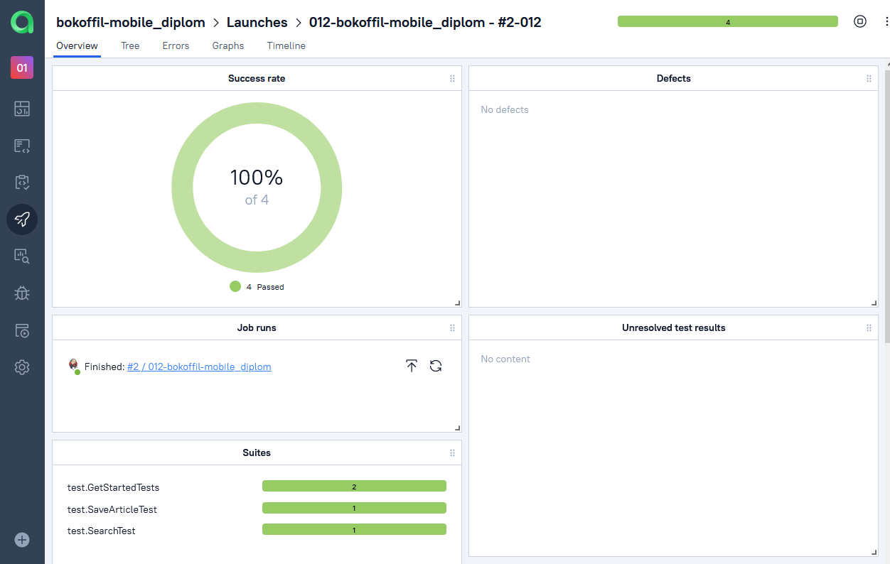
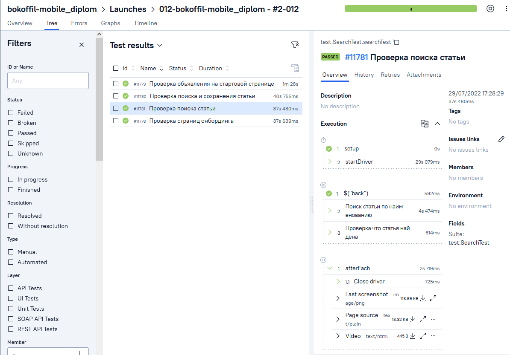
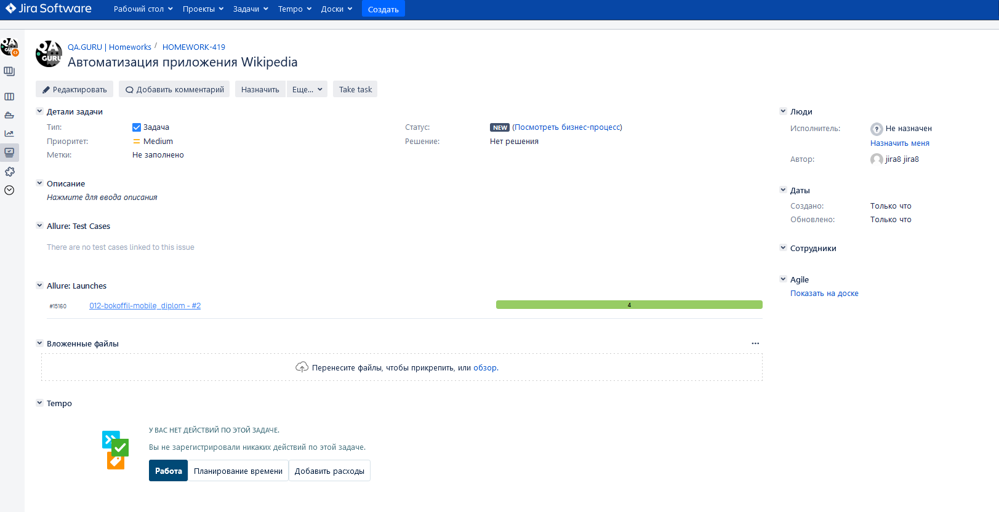
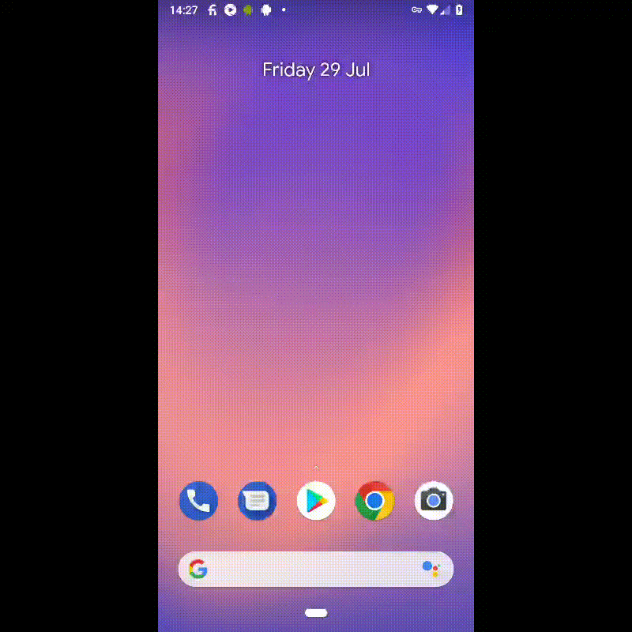

# Проект по автоматизации тестирования мобильного приложения "Wikipedia"

## :floppy_disk: Содержание:

- <a href="#computer-технологии-и-инструменты">Технологии и инструменты</a>
- <a href="#heavy_check_mark-реализованные-проверки">Реализованные проверки</a>
- <a href="#arrow_forward-запуск-из-терминала">Запуск из терминала</a>
- <a href="#electric_plug-сборка-в-jenkins">Сборка в Jenkins</a>
- <a href="#open_book-allure-отчет">Allure отчет</a>
- <a href="#robot-отчет-в-telegram">Отчет в Telegram</a>
- <a href="#open_book-интеграция-с-allure-testops">Интеграция с Allure TestOps</a>
- <a href="#open_book-интеграция-с-jira">Интеграция с Jira</a>
- <a href="#film_projector-видео-примеры-прохождения-тестов">Видео примеры прохождения тестов</a>

## :computer: Технологии и инструменты
<p align="center">


</p>

## :heavy_check_mark: Реализованные проверки

- Проверка страниц онбординга
- Проверка объявления на стартовой странице
- Проверка сохранения статьи
- Проверка поиска статьи

## :arrow_forward: Запуск из терминала

Удаленно:

```
gradle clean -Dhost=remote
```

Локально:

```
gradle clean -Dhost=local
```

## :electric_plug: Сборка в Jenkins

### <a target="_blank" href="https://jenkins.autotests.cloud/job/012-bokoffil-mobile_diplom/">Сборка в Jenkins</a>

<p align="center">

</p>  

## :open_book: Allure отчет

- ### Главный экран отчета

<p align="center">

</p>

- ### Страница с проведенными тестами

<p align="center">

</p>

- ### Страница дашбордов

<p align="center">

</p>

## :robot: Отчет в Telegram

<p align="center">

</p>

## :open_book: Интеграция с Allure TestOps

<p align="center">

</p>

<p align="center">

</p>

## :open_book: Интеграция с Jira

<p align="center">

</p>

## :film_projector: Видео примеры прохождения тестов
> К каждому тесту в отчете прилагается видео. Видео прохождения теста "Проверка сохранения статьи" представлено ниже.
<p align="center">
  
</p>